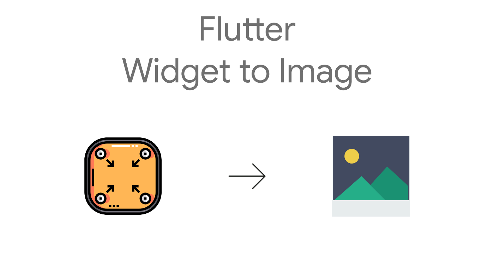

# Widgets To Image

[](https://pub.dev/packages/widgets_to_image)
[](https://opensource.org/licenses/MIT)
[](https://mohamedabdo.github.io/widgets_to_image/)

A powerful Flutter package to convert any widget into high-quality images with customizable formats, quality settings, and advanced features.

## 🌐 Live Demo

**[Try the interactive demo →](https://mohamedabd0.github.io/widgets_to_image/)**

Experience the package capabilities with our modern, professional demo featuring:

- 🎯 Basic widget capture examples
- ⚙️ Advanced configuration options
- 🎭 Animation capture demonstrations
- 📱 Responsive design with Material 3



## ✨ Features

- 🎯 **Simple API** - Convert any widget to image with just a few lines of code
- 🖼️ **Multiple Formats** - Support for PNG, JPEG, Raw RGBA, and Raw Unmodified formats
- ⚙️ **Customizable Options** - Control pixel ratio, quality, animations, and delays
- 🎨 **High Quality** - Generate high-resolution images with custom pixel ratios
- 🔄 **Animation Support** - Capture animated widgets with proper timing
- 📱 **Cross Platform** - Works on iOS, Android, Web, macOS, Windows, and Linux
- 🧪 **Well Tested** - Comprehensive test suite ensuring reliability
- 📚 **Rich Documentation** - Detailed examples and API documentation

## 🚀 Getting Started

### Installation

Add this to your package's `pubspec.yaml` file:

```yaml
dependencies:
  widgets_to_image: ^2.0.0
```

Install it using the command line:

```bash
flutter pub get
```

Import the package:

```dart
import 'package:widgets_to_image/widgets_to_image.dart';
```

## 📖 Usage

### Basic Usage

```dart
// Create a controller
WidgetsToImageController controller = WidgetsToImageController();

// Wrap your widget
WidgetsToImage(
  controller: controller,
  child: Container(
    width: 200,
    height: 100,
    color: Colors.blue,
    child: const Center(
      child: Text(
        'Hello World!',
        style: TextStyle(color: Colors.white, fontSize: 20),
      ),
    ),
  ),
)

// Capture the widget
Uint8List? bytes = await controller.capture();
```

### Advanced Usage with Options

```dart
// Capture with custom options
Uint8List? bytes = await controller.capture(
  options: const CaptureOptions(
    format: ImageFormat.jpeg,
    pixelRatio: 3.0,
    quality: 95,
    waitForAnimations: true,
    delayMs: 100,
  ),
);
```

### Convenience Methods

```dart
// Capture as PNG with high resolution
Uint8List? pngBytes = await controller.capturePng(
  pixelRatio: 3.0,
  waitForAnimations: true,
);

// Capture as JPEG with custom quality
Uint8List? jpegBytes = await controller.captureJpeg(
  quality: 90,
  pixelRatio: 2.0,
);
```

### Reactive UI with Builder

```dart
WidgetsToImageBuilder(
  controller: controller,
  builder: (context, isCapturing, capture) {
    return Column(
      children: [
        if (isCapturing)
          const CircularProgressIndicator()
        else
          ElevatedButton(
            onPressed: () async {
              final bytes = await capture();
              // Handle the captured bytes
            },
            child: const Text('Capture Widget'),
          ),
      ],
    );
  },
)
```

### Error Handling

```dart
try {
  final bytes = await controller.capture();
  // Success - use the bytes
} on CaptureException catch (e) {
  // Handle specific capture errors
  print('Capture failed: ${e.message}');
  if (e.originalError != null) {
    print('Caused by: ${e.originalError}');
  }
} catch (e) {
  // Handle other errors
  print('Unexpected error: $e');
}
```

### Lifecycle Callbacks

```dart
controller.onCaptureStart = () {
  print('Capture started');
};

controller.onCaptureComplete = (bytes) {
  print('Capture completed with ${bytes.length} bytes');
};

controller.onCaptureError = (error) {
  print('Capture failed: ${error.message}');
};
```

## 🔧 API Reference

### CaptureOptions

| Property            | Type          | Default           | Description                            |
| ------------------- | ------------- | ----------------- | -------------------------------------- |
| `pixelRatio`        | `double`      | `1.0`             | The pixel ratio for the captured image |
| `format`            | `ImageFormat` | `ImageFormat.png` | The output image format                |
| `quality`           | `int`         | `95`              | Quality for JPEG format (0-100)        |
| `waitForAnimations` | `bool`        | `false`           | Wait for animations before capturing   |
| `delayMs`           | `int`         | `0`               | Additional delay in milliseconds       |

### ImageFormat

- `ImageFormat.png` - PNG format with transparency support
- `ImageFormat.jpeg` - JPEG format with quality control
- `ImageFormat.rawRgba` - Raw RGBA pixel data
- `ImageFormat.rawUnmodified` - Raw unmodified pixel data

### WidgetsToImageController Methods

- `capture({CaptureOptions options})` - Capture with custom options
- `capturePng({...})` - Convenience method for PNG capture
- `captureJpeg({...})` - Convenience method for JPEG capture
- `dispose()` - Clean up resources

### WidgetsToImage Properties

- `controller` - The capture controller (required)
- `child` - The widget to capture
- `clipBehavior` - Whether to clip the child widget

## 📱 Example App

The package includes a comprehensive example app demonstrating:

- Basic widget capture
- Advanced options configuration
- Animated widget capture
- Different image formats
- Error handling
- Reactive UI updates

Run the example:

```bash
cd example
flutter run
```

## 🛠️ Platform Support

| Platform | Support |
| -------- | ------- |
| Android  | ✅      |
| iOS      | ✅      |
| Web      | ✅      |
| macOS    | ✅      |
| Windows  | ✅      |
| Linux    | ✅      |

## 🤝 Contributing

Contributions are welcome! Please read our [contributing guidelines](CONTRIBUTING.md) and submit pull requests to our repository.

## 📄 License

This project is licensed under the MIT License - see the [LICENSE](LICENSE) file for details.

## 🙏 Acknowledgments

- Flutter team for the amazing framework
- Community contributors for feedback and improvements

## 📞 Support

- 🐛 [Report bugs](https://github.com/MohamedAbd0/widgets_to_image/issues)
- 💡 [Request features](https://github.com/MohamedAbd0/widgets_to_image/issues)
- 📚 [Documentation](https://github.com/MohamedAbd0/widgets_to_image#readme)
- 💬 [Discussions](https://github.com/MohamedAbd0/widgets_to_image/discussions)

---

Made with ❤️ by [Mohamed Abdo](https://github.com/MohamedAbd0)


### MacOS


