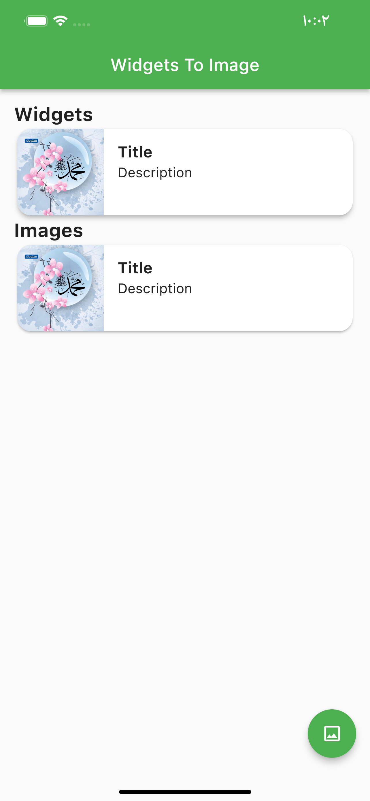

Widgets To Image
=====
A simple flutter package to export your widget to image with flutter


Installation
-----
1. Add this to your package's `pubspec.yaml` file:

```yaml
dependencies:
  widgets_to_image: any
```

1. Get the package using your IDE's GUI or via command line with

```bash
$ pub get
```

1. Import the `widgets_to_image.dart` file in your app

```dart
import 'package:widgets_to_image/widgets_to_image.dart';
```

Usage
-----

```dart
// WidgetsToImageController to access widget
WidgetsToImageController controller = WidgetsToImageController();
// to save image bytes of widget
Uint8List? bytes;

WidgetsToImage(
  controller: controller,
  child: cardWidget(),
),

final bytes = await controller.capture();
```


Screenshots
-----------


Helper resource 
-----------
Thanks to Parth Jansari (Twitter: @JohannesMilke)

https://medium.com/flutter-community/export-your-widget-to-image-with-flutter-dc7ecfa6bafb

https://www.youtube.com/watch?v=DSJ5vONP3XM

